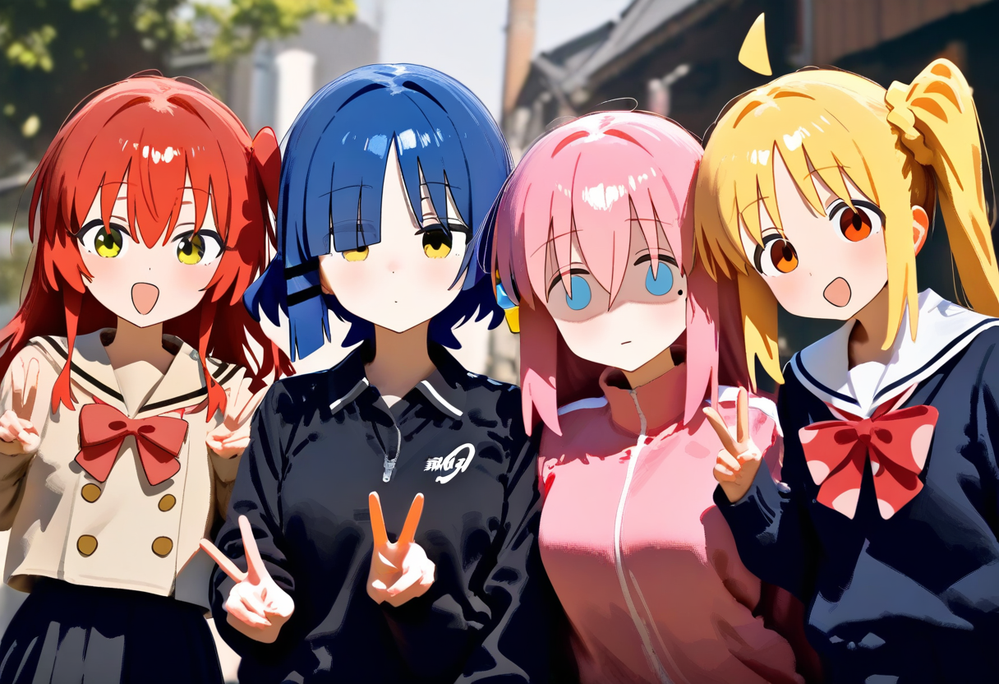

# Diskort Bot Menggunakan C Hastag

## Setup Environment & Run
Pastikan dotnet terinstall minimal versi 8.0 bos.

Sebelum itu atur beberapa Set User Secrets seperti
```bash
m1@LumiPyon ~ % dotnet user-secrets set "App:Token" "Discord Token Kamu"
m1@LumiPyon ~ % dotnet user-secrets set "StableDiffusion:Uri" "Backend Stable Diffusion Kamu (AUTOMATIC111 stable diffusion webui)"

```
Nanti tinggal run aja yah!!

## Hasil Generate

